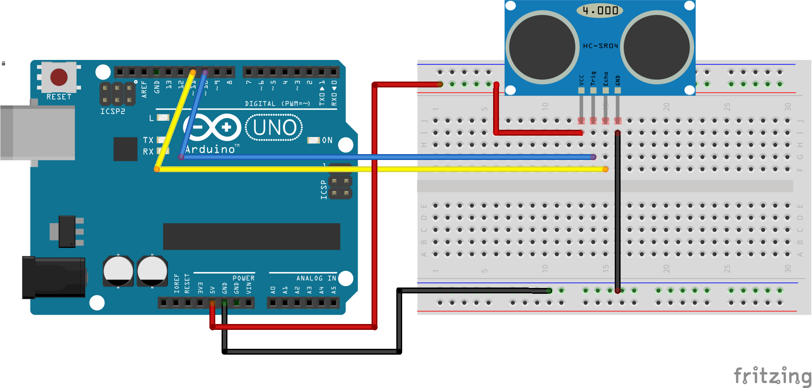

# Many Ways to Blink 5: Ultrasonic Sensor to Computer

This tutorial turns your computer screen into one giant LED. You will be able to control the blink rate of you computer screen with the ultrasonic sensor. This is a little over kill :) but the point is to see your computer as an ouput block for the arduino. To do this we will use a new program called <a href="http://www.processing.org/">Processing</a>. If you do not have it on your computer you should <a href="https://www.processing.org/download/">download</a> and install it. Processing is the equivalent of Arduino but it works on the Computer as opposed to a microcontroller. 

It was originally made to make it easier to do computer art visualizations and other computations.We will be using a prebuilt sketch that you can download from the tutorial page. This code uses the Processing equivalent of the Serial library to receive messages from the Arduino. The key thing about this though is that the Processing code uses the Serial port on the computer so you can NOT run the Serial Monitor at the same time as this code. 

We will be sending messages from the Ardino to Processing in text. Whenever you are sending messages you run into a series of issues. The first one is how do does the computer know when you are done with a message. In human speech we know when someone is done talking when they pause. The computer does not have eyes :) and is much less sophisticated so it can not do this. Instead we must specifically tell the computer when the message is done. We do this with what is called a "termination character". This is usually a single character that is put at the end of the message and the moment the computer sees this character it know that the message is complet and that it can process it.  Any character can be used for this but it is best if it one that will never be used in a normal text. Conveniently is problem has been solved already. All of the character you see on this screen are part of the <a href="http://www.asciitable.com/">ascii character set</a>. This defines the binary sequence the represent "a", "b", etc. They also included in the set characters that exist but are not displayed. One of these is the New Line (denoted "\n") character or the number 13. This character tells the computer when to display character on the next line of the screen. You can think of it as what is done when you hit the Return key on your keyboard. Because this character is never displayed it makes a great termination character so that is what we will use for this tutorial. 

# Block Diagram

# Circuit
* Unplug the Arduino. When you are change hardware the circuit should not be powered. That way you can avoid things like short circuits.
* To set up the circuit see the fritzing diagram for this tutorial

* NOTE: the ulrasonic sensor gives false readings if the distance to the object is greater than the max distance in the code. For testing be sure that you have a object (like a box) that at a distance less than the max. 
* Plug the Arduino back in 

# Code Steps
* Save the "Many Ways to Blink 5" code as "Many Ways to Blink 5"
* NOTE: The full code is at the end this tutorial
* You can see all the changes to the code <a href="">here</a>
* We no longer have the servo in the circuit so remove the lines

	
    #include <Servo.h>
    ...
    Servo myservo;  // create servo object to control a servo a maximum of eight servo objects  can be created
    ...
    myservo.attach(9);  // attaches the servo on pin 9 to the servo object

* We need to add the termination character variable in the variable initalization section. 

	
    char Terminator = '\n';  

* Then we need to replace the lines that moved the servo with the lines that send message to the computer. So replace the lines 

    myservo.write(155);
    delay(delayTime); 
    myservo.write(30);
    delay(delayTime);  

 with 

    Serial.print("ON"); Serial.print(Terminator);
    delay(delayTime);        
    Serial.print("OFF"); Serial.print(Terminator);
    delay(delayTime);                  

* Upload the code to the Arduino 
* Download Computer Blink.pde from <a href="">here</a>
* Unzip it
* Open Computer Blink.pde with Processing
* Run Computer Blink
* You should see the Serial stream start the appear at the bottom of the Processing window. And the window that pops up should change from white to block at a rate control by the Ultrasonic sensor.  
* If you do not see this find the name of the serial port in the list that appears when the program is started. This will match the name of the port you connect to with the Arduino IDE. If it is not at the top of the list count up from zero until you get to its location. Then in Computer Blink.pde change the line

    myPort = new Serial(this, Serial.list()[0], 9600);

to

    myPort = new Serial(this, Serial.list()[<your number>], 9600);

* To end the Processing program hit any button on the keyboard. 
* The last this to do is updating the descriptions to match the hardware.
* You are done with this tutorial!!
* OPTIONAL: Make the screen the same size as you computer screen buy changing the dimensions in the line 

	size (400, 400);

to the size of your screen. The run the program again. Now you have a one really expensive LED!

# Full Code
    <%= many-ways-to-blink-5.ino =%>